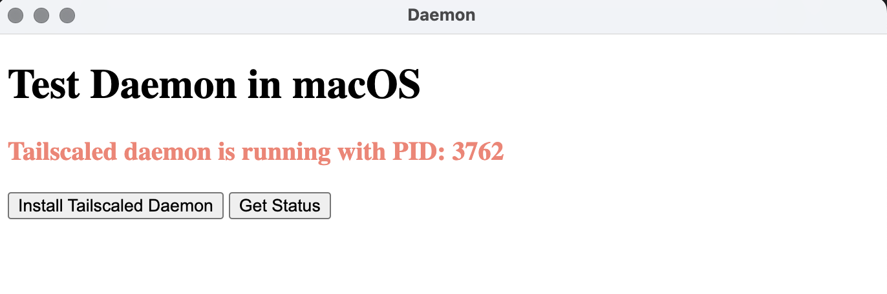
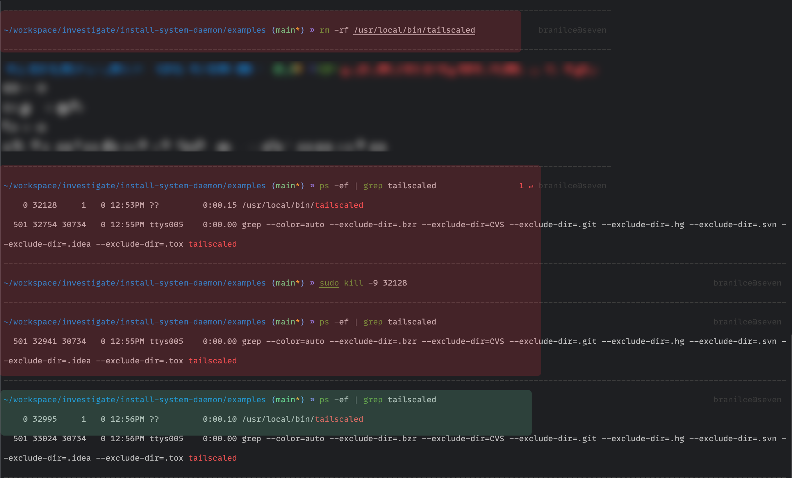

# install-system-daemon

this repo is used to test how to use Nodejs to add TailScaled to the Macos daemon to provide services for tailscale;

## Table of contents
- Examples: use cases in Electron

## Images

